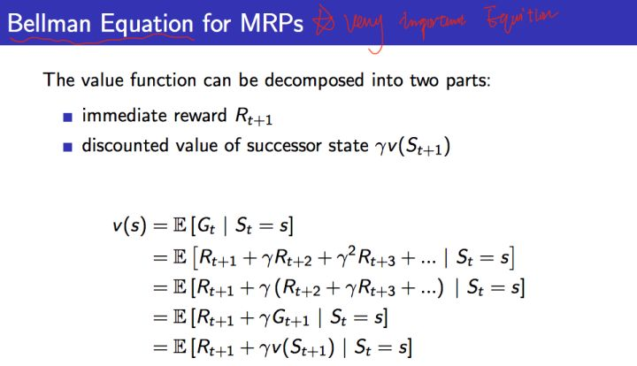
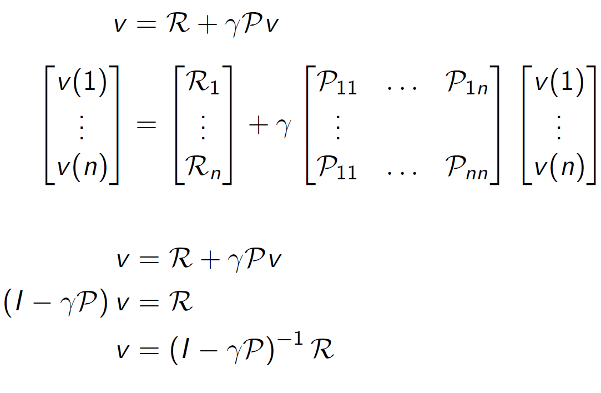
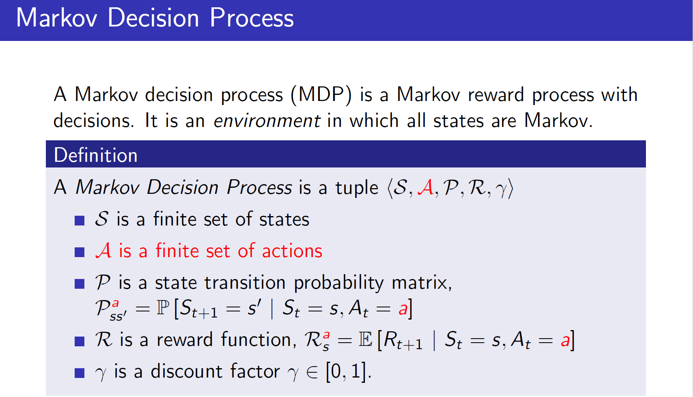
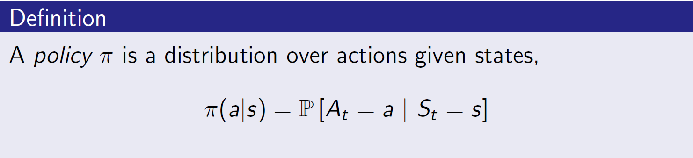
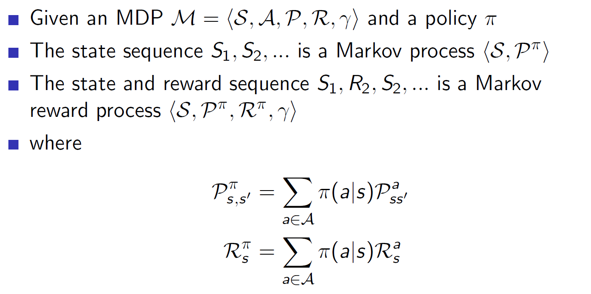
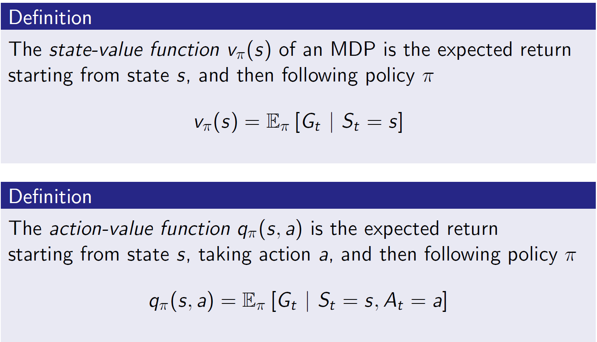
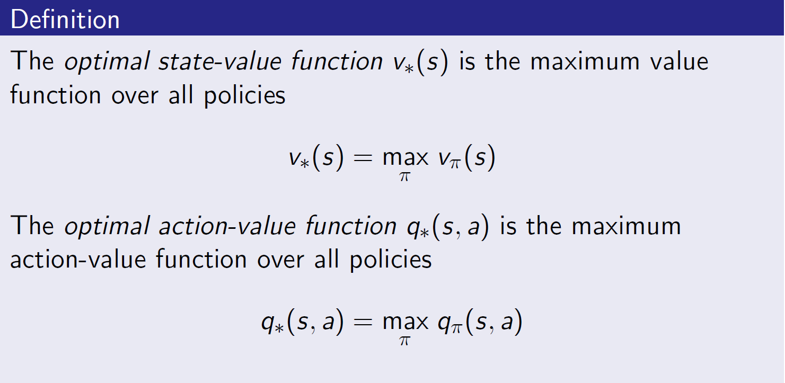
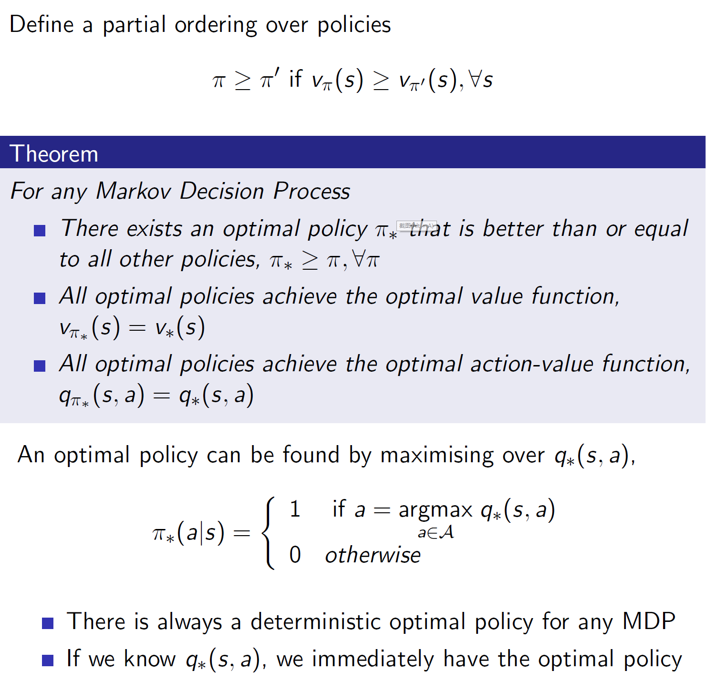
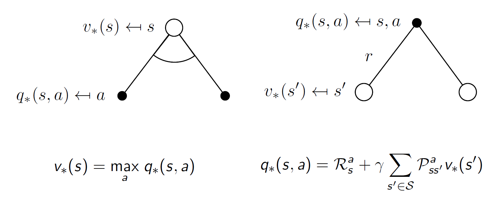
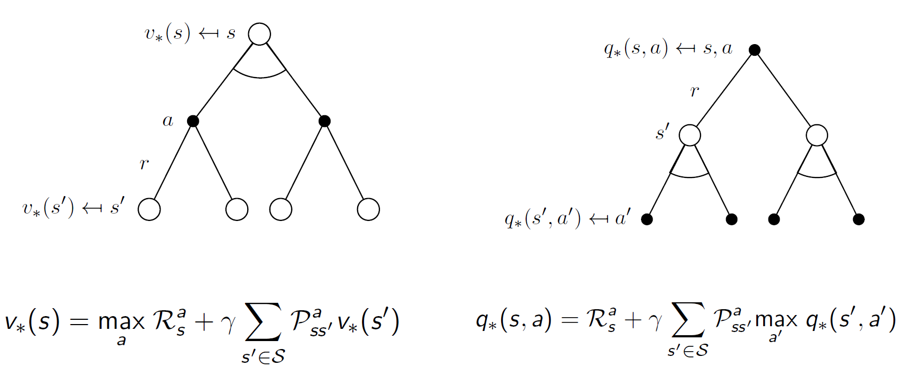

### Markov Process

#### Definition

- 元组 $(\mathcal{S,P})$
- $\mathcal{S}$是一个有限状态的集合
- $\mathcal{P}$是一个状态转移矩阵：$\mathcal{P_{ss'}}=\mathbb{P}[\mathcal{S_t+1}=s'|\mathcal{S_t}=s]$

### Markov Reward Process

- 在前者的基础上，增加了$(\mathcal{S,P,\color{red}{\mathcal{R,\gamma}}})​$
- $\color{red}{\mathcal{R}是一个奖励函数，\mathcal{R_s}=\mathbb{E}[R_{t+1}|\mathcal{S}=s]}$
- $\color{red}\gamma是一个衰减因子，\gamma\in[0,1]$

奖励函数$\mathcal{R}$代表了从状态$s$转移到状态$s'$时获得的奖励，这里奖励是离开状态后得到的(至于离开得到奖励还是进入一个新状态得到奖励只是定义了一种获得的规则而已)

#### $G_t$

$$
G_t=R_{t+1}+\gamma R_{t+2}+...=\mathcal{\sum_{k=0}^{\gamma^k}}R_{t+k+1}
$$

代表了从状态$s$到最后状态$s_t$，得到的最终奖励，加入$\gamma$是因为距离越远，影响越小。即某一个具体episode所获得的return。

目标是将其最大化。

#### 价值函数(Value Function)

$$
v(s)=\Bbb{E}[G_t|\mathcal{S_t}=s]
$$

其代表着在状态$s$下的，$G_t$的期望值，因为从一个状态s出发有很多种不同的决策路径，得到不同的$G_t$

#### 贝尔曼方程([Bellman equation](https://en.wikipedia.org/wiki/Bellman_equation))

最后一行理由为：x的期望的期望是x期望其本身.得到了一个重要的**递归**公式:
$$
\begin{align}
v(s) &= \Bbb{E}[R_{t+1}+\gamma v(\mathcal{S_{t+1}})|\mathcal{S_t}=s] \\
&=\mathcal{R_s}+\gamma \sum_{s'\in S}\mathcal{P}_{ss'}v(s')
\end{align}
$$

其有两部分组成，及时奖励的期望$\boldsymbol{R_{t+1}}$  ,下一个时刻状态$\boldsymbol{s_{t+1}}$ 的期望

#### 矩阵求解

### Markov Decision Process

### 策略(policy)

策略代表了在给定状态$s$下，可能的动作概率分布。

### 价值函数-2

$$
\begin{align}
v_\pi(s)&=\sum_{a\in\mathcal{A}}\pi(a|s)q_\pi(s,a) \\
q_\pi(s,a)&=\mathcal{R}_s^a+\gamma\sum_{s'\in\mathcal{S}}\mathcal{P}_{ss'}^av_\pi(s')
\end{align}
$$
===>
$$
\begin{align}
v_\pi(s)&=\sum_{a\in\mathcal{A}}\pi(a|s)(\mathcal{R}_s^a+\gamma\sum_{s'\in\mathcal{S}}\mathcal{P}_{ss'}^av_\pi(s'))\\
q_\pi(s,a)&=\mathcal{R}_s^a+\gamma\sum_{s'\in\mathcal{S}}\mathcal{P}_{ss'}^a\sum_{a\in\mathcal{A}}\pi(a'|s')q_\pi(s',a')
\end{align}
$$
可以发现，也是个递归地过程

$v_\pi(s)$是由当前状态$s$下，策略$\pi$可能的动作概率*该动作下得到的奖励值，累加而成

$q_\pi(s,a)$由两部分组成，及时回报和执行这个操作后可能到达所有状态$s'$的价值函数的累加

### 将其最优化

### 最优策略

### 最优状态动作价值函数

彼此带入：

### 如何求解

得到最优解的递归形式，如何求解就很关键了。主要方法有：value Function(Q-learning,Sarsa);Policy gradient(PPO);AC等等.

*Fig.  Summary of approaches in RL based on whether we want to model the value, policy, or the environment. (Image source: reproduced from David Silver’s RL course lecture 1.)* 

### On-policy vs Off-policy

- **Model-based**: Rely on the model of the environment; either the model is known or the algorithm learns it explicitly.(*When we fully know the environment, we can find the optimal solution by [Dynamic Programming](https://en.wikipedia.org/wiki/Dynamic_programming) (DP).*)
- **Model-free**: No dependency on the model during learning.
- **Model-based**尝试着model整个环境；先model了这个环境，基于该环境做出最优的策略；**Model-free**就是走一步看一步，在每一步中去尝试学习最优的策略。
- *The model-based learning uses environment, action and reward to get the most reward from the action. The model-free learning only uses its action and reward to infer the best action.*

- **On-policy**: The agent learned and the agent interacting with the environment is the same.(**自己和环境互动**)
- **Off-policy**:The agent learned and the agent interacting with the environment is different.(**自己看别人玩**)

### Inference

[csdn-blog](<https://blog.csdn.net/liweibin1994/article/details/79079884>)

[David Silver强化学习公开课](https://zhuanlan.zhihu.com/p/28084942)

David Silver slides